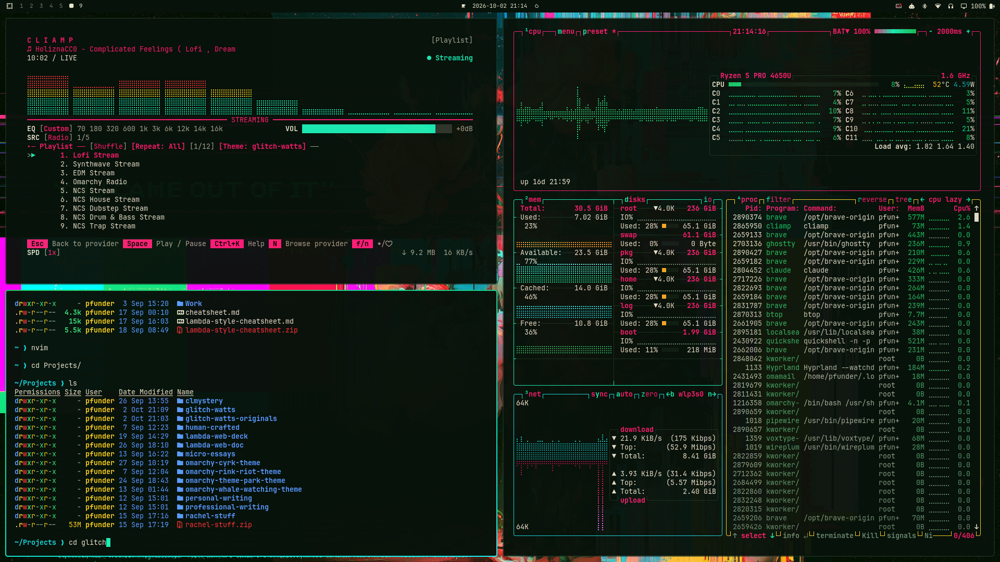

# Glitch Watts

A very dark [Omarchy](https://omarchy.org/) theme for people who suspect the
signal was the noise all along.

Eleven portraits of Alan Watts and some unreasonably lush roses went through a
broken television and came back better. Hot-pink color bars, TV cyan, and
phosphor-green text, all floating on a moss-green so dark it's basically
midnight that hasn't committed yet.



## Install

```bash
omarchy theme install https://github.com/pfunderdome/omarchy-glitch-watts-theme.git
```

Or clone it manually into `~/.config/omarchy/themes/`:

```bash
git clone https://github.com/pfunderdome/omarchy-glitch-watts-theme.git \
  ~/.config/omarchy/themes/glitch-watts
omarchy theme set glitch-watts
```

## Palette

| Role              | Hex       |                                                      |
| ----------------- | --------- | ---------------------------------------------------- |
| Background        | `#07120a` | moss at midnight, from the shadows behind the code   |
| Foreground        | `#e8e4cc` | warm parchment, from the frame around glitch #10     |
| Accent            | `#fd1d72` | hot pink, the loudest color bar in every frame       |
| Cursor            | `#1cefb6` | phosphor green, from "YOU CAME OUT OF IT"            |
| Red               | `#f2343a` | rose red                                             |
| Orange            | `#f5852e` |                                                      |
| Yellow            | `#fdd321` | color-bar gold                                       |
| Green             | `#3ddc77` | terminal green                                       |
| Cyan              | `#18d8dc` | TV cyan                                              |
| Blue              | `#5c9dff` |                                                      |
| Magenta           | `#ec3fb5` |                                                      |
| Selection         | `#18301e` | a slightly less dark green, which is still dark      |

Every text color clears 4.8:1 against the background (WCAG AA). The neon is
loud, but you can still read it.

### About the cursor

Omarchy paints every cursor with `bright_foreground`. Here that's phosphor
green. That means ANSI bright white glows mint too. Think of it as the
terminal remembering it used to be a CRT.

## What's included

- `colors.toml`: the full palette. Omarchy generates everything else from it
  (terminals, Neovim, VS Code, Helix, Chromium, the shell, lock screen,
  keyboard RGB, and so on), including a phosphor-to-cyan gradient window
  border.
- `btop.theme`: graphs climb from moss through phosphor into hot pink, the way
  a signal goes from fine to "fine" to on fire.
- `backgrounds/`: all eleven glitch portraits plus a plain moss wallpaper for
  days when you'd rather not be looked at. Cycle with
  `omarchy theme bg next`.
- `unlock.png` / `preview-unlock.png`: the Omarchy logo printed twice, once in
  pink and once in cyan, slightly out of register, with a scanline tear across
  the middle. On purpose.
- `icons.theme`: Yaru-magenta folders.
- `cliamp.toml`: a theme for the [cliamp](https://github.com/bjarneo/cliamp)
  music player, which Omarchy doesn't theme on its own. Hot pink, phosphor,
  moss. Copy it to `~/.config/cliamp/themes/glitch-watts.toml` and run
  `cliamp theme glitch-watts`. The lofi will sound exactly the same, but
  you'll know.
- `preview.png`: desktop preview shown in the theme switcher.

The theme ships no Lua or terminal configs, so it looks the same whether you
install it from git or link a local working copy.

## A note on the text

The green words in the wallpapers come from Watts: *you didn't come into this
world, you came out of it, like a wave from the ocean.* Same goes for your
windows. They didn't come into this desktop. They came out of it.

## License

[MIT](LICENSE). The artwork in `backgrounds/` is by Shawn Pfunder.
